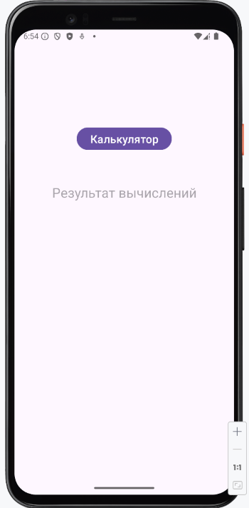
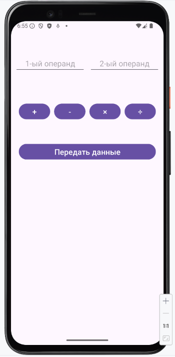
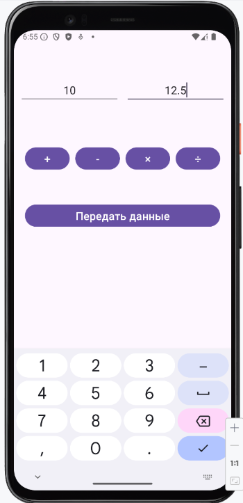
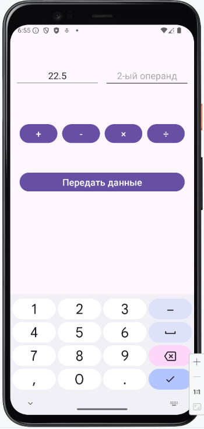
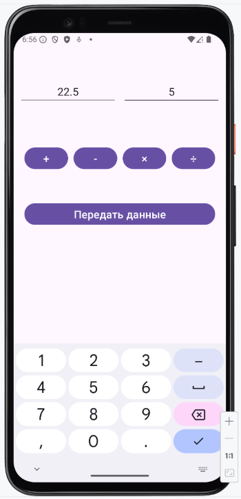
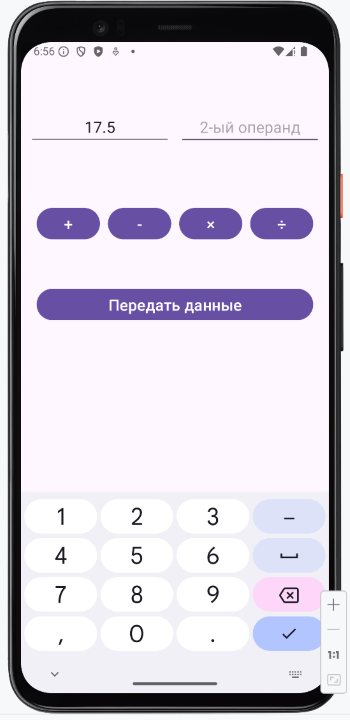
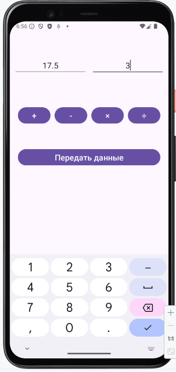
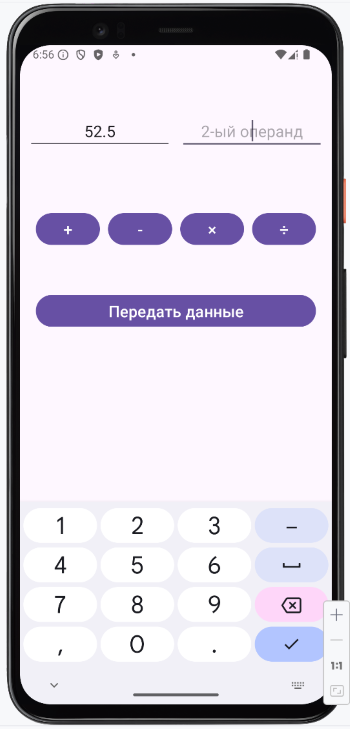
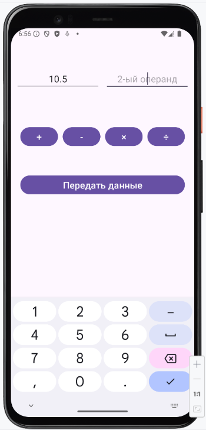
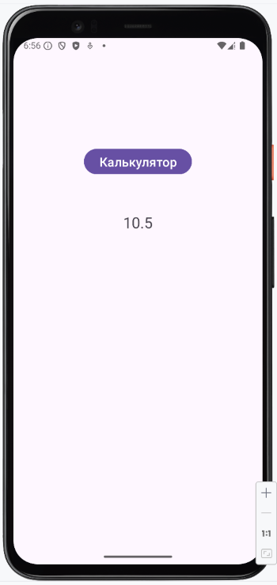

# Домашнее задание по теме "Intent"

### Программа «Скрытый калькулятор»

Написать программу, состоящую из двух экранов.

1. На главном экране необходимо создать кнопку перехода на второй экран «Калькулятор», где будет находиться скрытый калькулятор.

2. На главном экране также находится поле вывода информации, на которое будет возвращаться результат вычислений скрытого калькулятора.

При нажатии на кнопку «Калькулятор» выполняется переход на второй экран. На втором активити:

1. Необходимо создать два поля ввода информации
2. Необходимо создать четыре кнопки: сложения, вычитания, умножения, деления. Написать соответствующую логику производства вычислений в зависимости от нажатой кнопки. 
3. Необходимо создать кнопку передачи полученного результата в первое активити «Передать данные» и  описать логику передачи данных. При нажатии на кнопку выполняется переход на первый экран.
4. В результате в поле вывода информации первого активити выводится результат работы скрытого калькулятора.

Приложение необходимо сохранить проектом в удаленном репозитории, для проверки качества предоставить ссылку преподавателю, либо сделать скрин эмулятора каждого шага работы приложения. 

### Скриншоты домашнего задания

Скриншоты здесь

